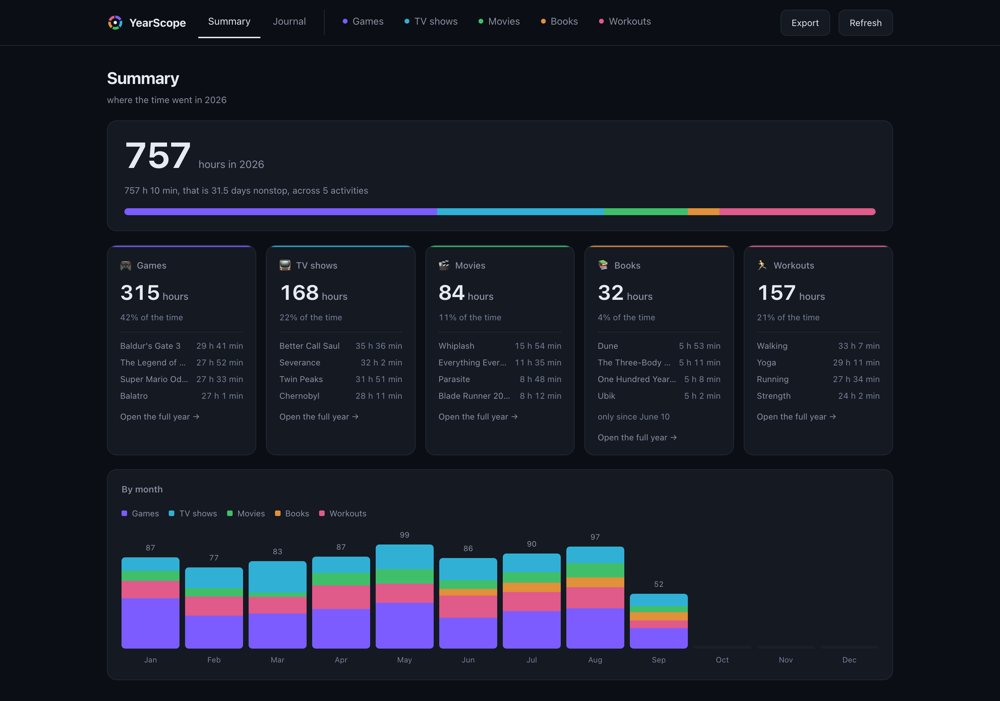

<p align="center">
  <picture>
    <source media="(prefers-color-scheme: dark)" srcset="public/logo.svg" />
    
  </picture>
</p>

<p align="center">
  Games, TV shows, movies, books and workouts on one screen.
</p>

<p align="center">
  
  
</p>

<p align="center">
  
</p>

## What it is

You play, watch, read and work out, and every service only knows its own slice. YearScope pulls them together into a single picture. Self-hosted.

## Where the data comes from

- 🎮 games: [gowithme.club](https://gowithme.club)
- 📺 TV shows: [myshows.me](https://myshows.me)
- 🎬 movies: [letterboxd.com](https://letterboxd.com)
- 📚 books: [koshelf](https://github.com/scampower3/koshelf)
- 🏃 workouts: [intervals.icu](https://intervals.icu)

## Setup

```bash
cp .env.example .env
npm start
```

Or with Docker:

```bash
docker compose up -d --build
```

What to put in `.env` is described in [`.env.example`](.env.example). How the sources work is covered in [docs/sources.md](docs/sources.md).

## License

[MIT](LICENSE)
