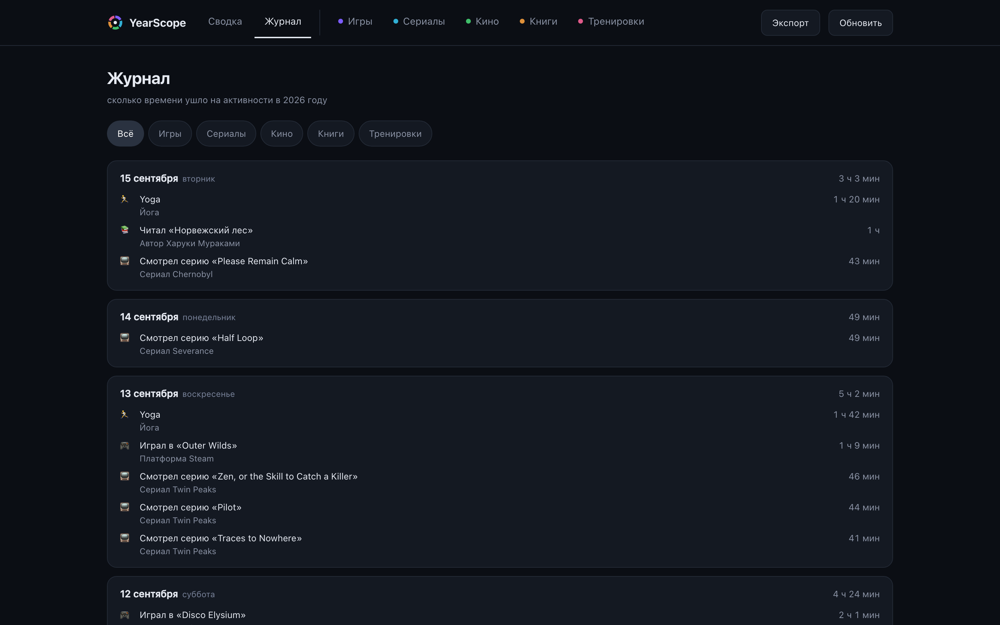
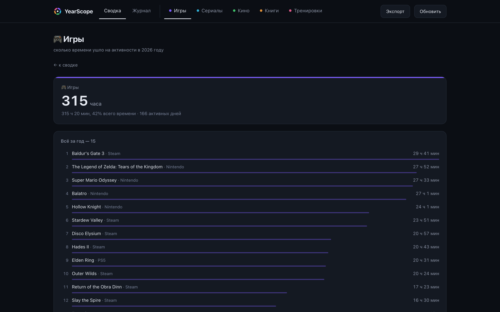
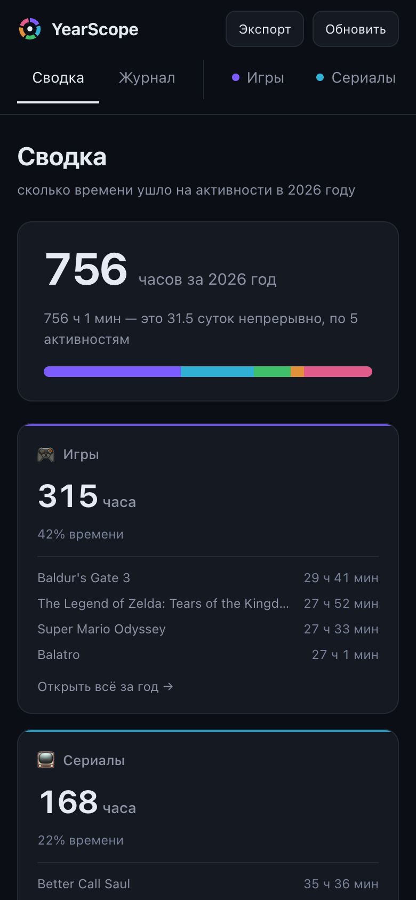

<p align="center">
  <picture>
    <source media="(prefers-color-scheme: dark)" srcset="public/logo.svg" />
    
  </picture>
</p>

<p align="center">
  <b>Куда ушёл твой год.</b><br />
  Игры, сериалы, кино, книги и тренировки — на одном экране и в сумме часов.
</p>

<p align="center">
  
  
  
  
</p>

<p align="center">
  
</p>
<p align="center"><sub>Здесь и ниже — демо-данные: вымышленный год, который поднимается одной командой.</sub></p>

---

## Что это

Ты играешь, смотришь, читаешь и тренируешься — и каждый сервис знает только свой кусочек. YearScope собирает их в одну картину: **сколько часов за год, на что именно и в каком месяце**.

Всё работает дома. Аккаунтов нет, трекинга нет, данные лежат в одном файле SQLite рядом с сервисом.

## Откуда данные

| Активность | Источник |
|---|---|
| 🎮 Игры | [gowithme.club](https://gowithme.club) |
| 📺 Сериалы | [myshows](https://myshows.me) |
| 🎬 Кино | [Letterboxd](https://letterboxd.com) + TMDB |
| 📚 Книги | [KoShelf](https://github.com/scampower3/koshelf) |
| 🏃 Тренировки | [intervals.icu](https://intervals.icu) |

Источники не подгоняются друг под друга. Если сервис ведёт учёт только с июня — так и написано на экране рядом с итогом, а не спрятано в мелком шрифте.

## Экраны

<table>
  <tr>
    <td width="50%">
      <br />
      <b>Журнал</b> — лента по дням, сверху свежее. Что за фильм, какая серия, какая тренировка и сколько это заняло.
    </td>
    <td width="50%">
      <br />
      <b>Карточка активности</b> — полный рейтинг за год и лента только по ней. Открывается кликом по карточке в сводке.
    </td>
  </tr>
</table>

<p align="center">
  
</p>
<p align="center"><sub>С телефона — тоже. Открывается в домашней сети, без приложений.</sub></p>

## Попробовать за минуту

```bash
npm run demo           # → http://localhost:3010
```

Поднимет тот самый вымышленный год со скриншотов. Ни ключей, ни аккаунтов, ни сети — данные генерируются локально и живут отдельно от настоящей базы.

## Запуск по-настоящему

```bash
cp .env.example .env   # вписать свои ники и ключи
npm start              # → http://localhost:3010
```

`npm install` не нужен: **ноль зависимостей** — свежий Node умеет SQLite и TypeScript из коробки.

В Docker:

```bash
docker compose up -d --build
```

## Настройка

Всё в `.env`. Обязательных полей нет: незаполненный источник просто выключается, остальные работают.

| Переменная | Зачем |
|---|---|
| `GOWITHME_PLAYER`, `LETTERBOXD_USER`, `MYSHOWS_LOGIN` | твои ники в этих сервисах |
| `KOSHELF_BASE_URL` | адрес KoShelf в сети |
| `INTERVALS_API_KEY`, `INTERVALS_ATHLETE_ID` | тренировки из intervals.icu |
| `TMDB_API_KEY` | точный хронометраж фильмов (без него — оценка по средней длительности) |

История сериалов берётся из выгрузки профиля myshows — положи `.xlsx` в `data/imports/`.

Остальное — порт, год, частота синхронизации, часовой пояс — есть в [`.env.example`](.env.example) со значениями по умолчанию.

## Экспорт

Кнопка **Экспорт** отдаёт год целиком: JSON со сводкой, журналом и топами — или плоский CSV для Excel.

## Подробности

[Как устроены источники](docs/sources.md) — почему Letterboxd приходится накапливать, откуда берётся история myshows, зачем сходятся часовые пояса, модель данных и HTTP API.

## Лицензия

[MIT](LICENSE) — бери, форкай, меняй.
